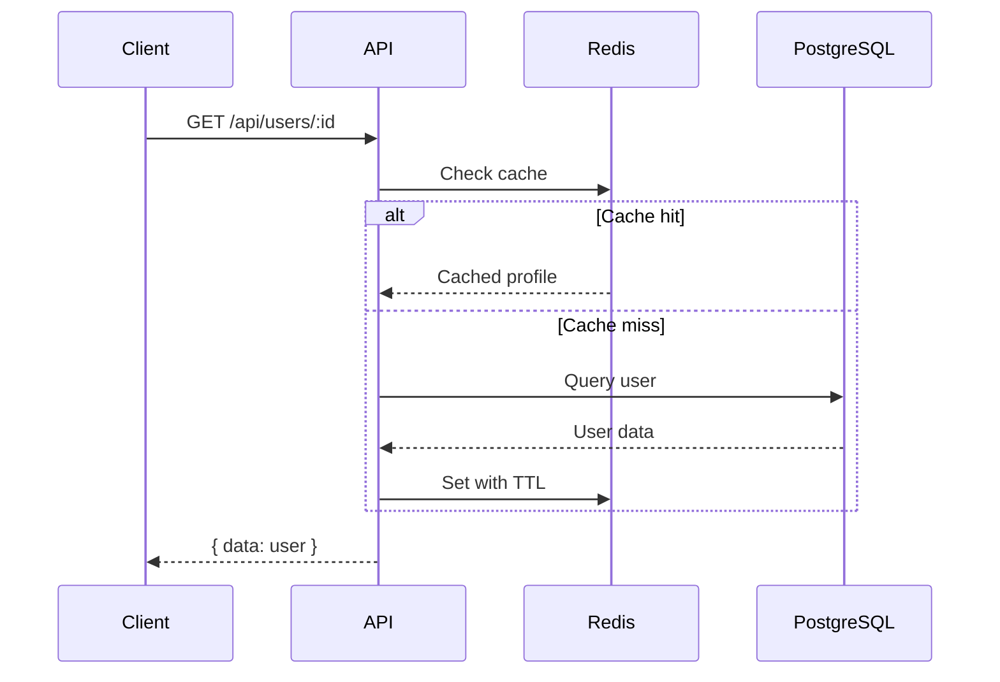

# Architect Examples

## Example: Caching layer decision

**Input**: `Should we add a caching layer for our user profile API?`

**Output**:

```
## Architectural Decision Record

### Context
The user profile API is experiencing increased latency under load. Profile data changes infrequently but is read on every page load.

### Options Considered

| Option | Pros | Cons |
|--------|------|------|
| Redis cache | Fast reads, TTL support, widely adopted | New infrastructure dependency, cache invalidation complexity |
| In-memory cache (node-cache) | No new infra, simple setup | Lost on restart, not shared across instances |
| HTTP caching (ETags + CDN) | No app changes needed, scales well | Less control over invalidation, CDN cost |

### Decision
Recommend **Redis cache** with a 5-minute TTL and cache-aside pattern.

### Consequences
- **Enables**: Sub-millisecond reads, reduced DB load
- **Constrains**: Requires Redis in staging/prod, team needs cache invalidation strategy
- **Risks**: Stale data window of up to 5 minutes
```


