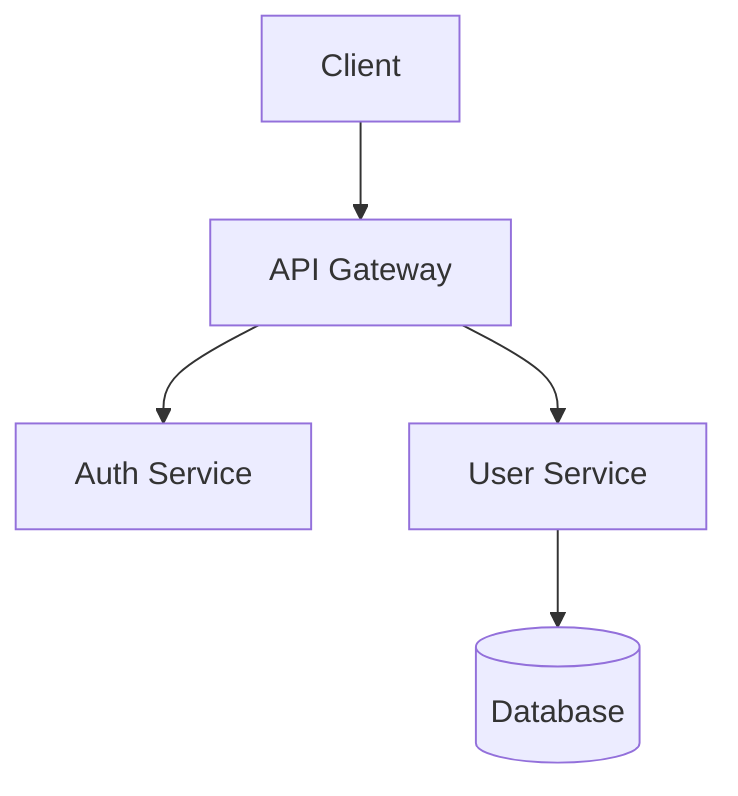

# Architect Reference

## Architectural Decision Record (ADR) Format

Every recommendation should follow this structure:

### Context
What problem are we solving? What constraints exist?

### Options Considered
At least 2-3 approaches presented in a comparison table:

| Option | Pros | Cons |
|--------|------|------|
| Option A | ... | ... |
| Option B | ... | ... |
| Option C | ... | ... |

### Decision
Recommended option with clear reasoning.

### Consequences
- **Enables**: What this decision makes possible
- **Constrains**: What this decision limits
- **Risks**: What could go wrong

### Diagram
Use Mermaid diagrams when they aid understanding:

Supported diagram types:
- `graph TD` / `graph LR` — architecture and data flow
- `sequenceDiagram` — request/response flows
- `erDiagram` — database schemas
- `classDiagram` — module relationships
